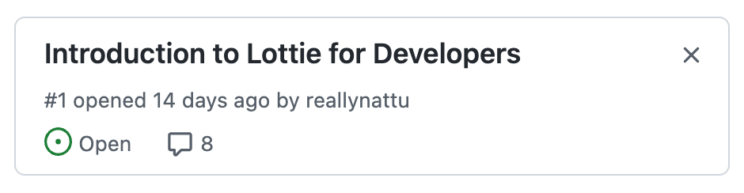
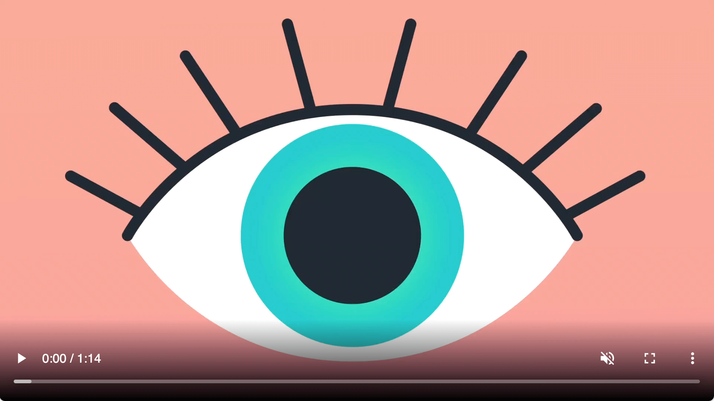
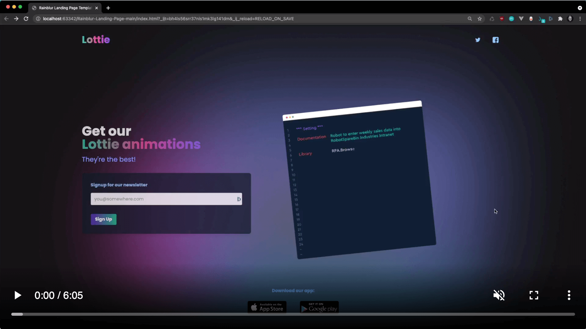
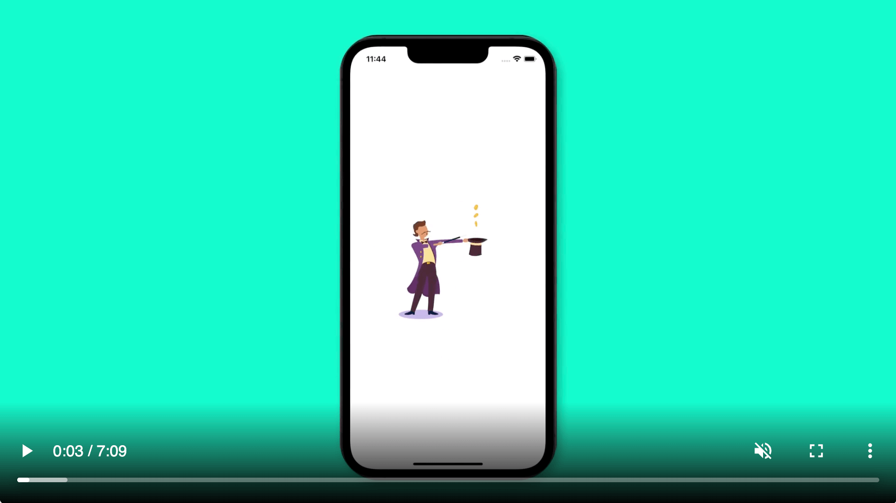
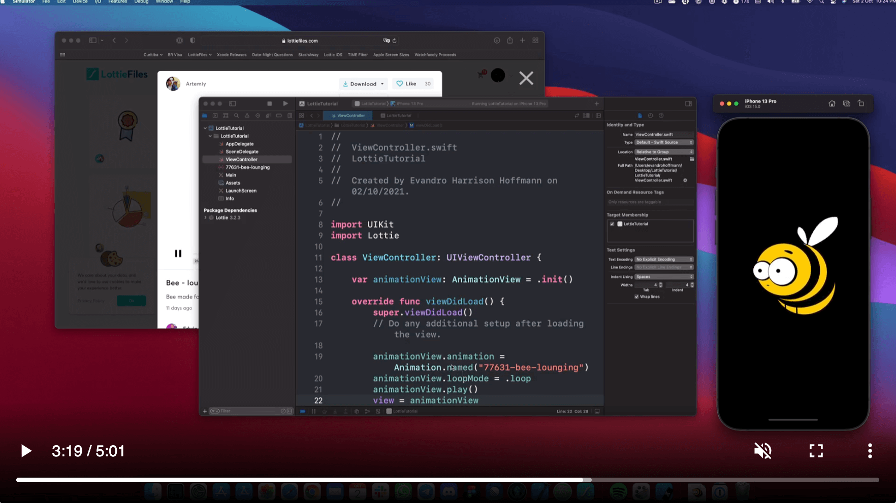
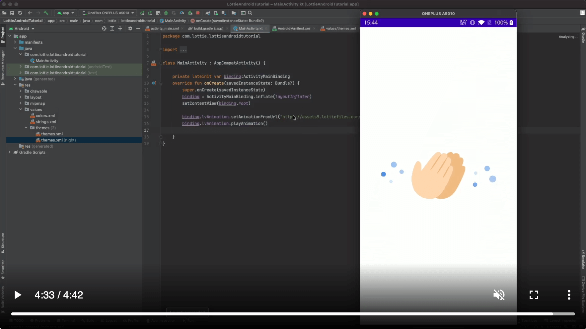
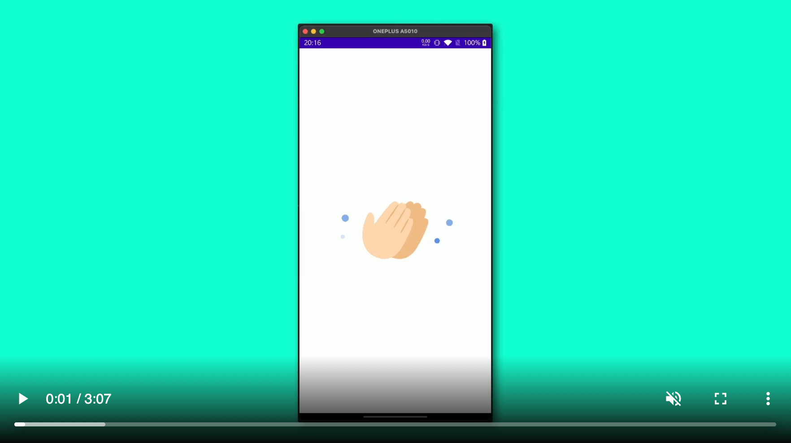
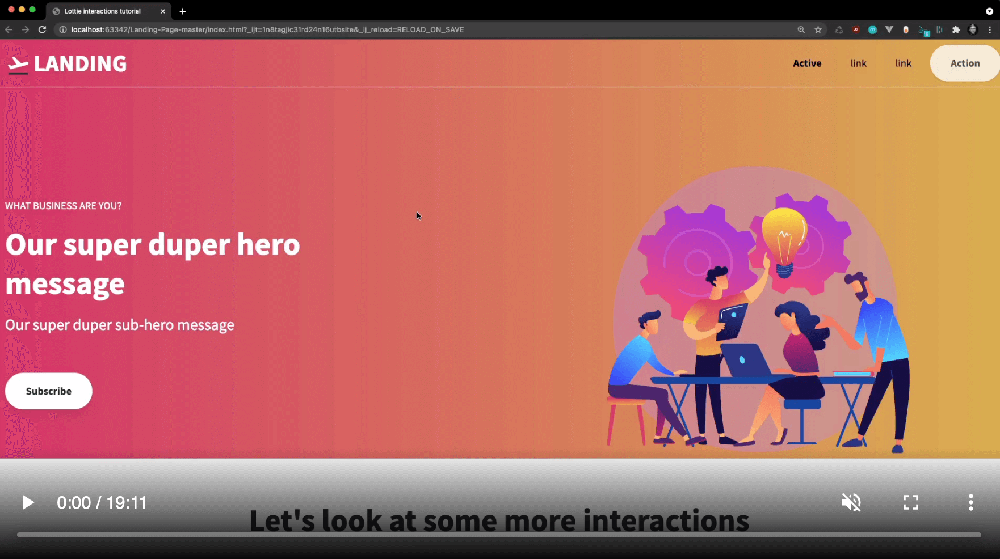
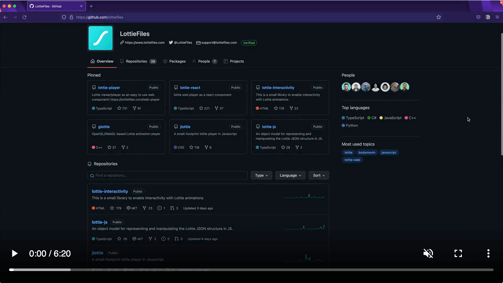

# Introduction to Lottie Animations for Developers

_Learn how to add Lottie animations to your websites and apps in less than an hour._

Motion is becoming a key ingredient of any digital experience. Lottie animations, which are animations created with Adobe After Effects and exported as JSON, bring apps to life and make websites more engaging to visitors. “Introduction to Lottie Animations for Developers” course guides you through everything you need to start shipping motion to your products.

- **Who is this for**: Web and Mobile app developers.
- **What you'll learn**: How to implement Lottie animations on websites, iOS and Android apps.
- **Prerequisites**: JavaScript for Web developers, Kotlin or Jetpack Compose and Swift for mobile implementations.
- **How long**: This course consists of total 7 video tutorials. 

# How to start this course

1. Navigate to [Issues](https://github.com/LottieFiles/Course-for-Developers/issues) from the top navigation in this repository. 

1. Click on [Pinned Issue](https://github.com/LottieFiles/Course-for-Developers/issues/1) to begin the course.

# Course Episodes

## Why Motion?
Motion has always been part of human nature, and it is in every aspect of our lives. The LottieFiles team takes to the world of motion and why you should apply it to your products.

## 01. Apply Lottie on the web
In this video, we show you how to set up a Lottie Animation to autoplay. And also how to trigger Lottie animations while hovering.

## 02. Implementing Lottie Animation in SWIFTUI
In this video, we will teach you how to work with Lottie Animations with SWIFTUI and Xcode.

## 03. Working with Lottie Animations & UIKit
In this video, we will teach you how to use Lottie Animations in your iOS projects.

## 04. Lottie on Android Studio
In this video, we will show you how to use Lottie Animations with Android Studio.

## 05. Lottie on Android with Jetpack Compose
In this video, we will show you how to work with Lottie Animations Android Studio and Jetpack Compose.

## 06. Lottie Interactivity Library
In this video, we're going to be learning how to add interactions to Lottie animations using the Lottie interactivity library.

## 07. Open-source LottieFiles
In this video, we are going to talk about some of the open-source projects, like Jlottie and Lottie Player. And how you might be able to get involved.

# Free Resources & Links
- What is Lottie? [Link](https://lottiefiles.com/what-is-lottie)
- Free-to-use high-quality Lottie Animations contributed by the community at LottieFiles. [Link](https://lottiefiles.com/what-is-lottie)
- Open-source libraries to integrate Lottie to more platforms. [Link](https://lottiefiles.com/integrations#:~:text=to%20a%20CDN.-,Lottie%20libraries,-A%20complete%20ecosystem)

Get help: [Post in our discussion board](https://github.com/LottieFiles/Course-for-Developers/discussions)

&copy; 2022 LottieFiles &bull; [CC-BY-4.0 License](https://creativecommons.org/licenses/by/4.0/legalcode)